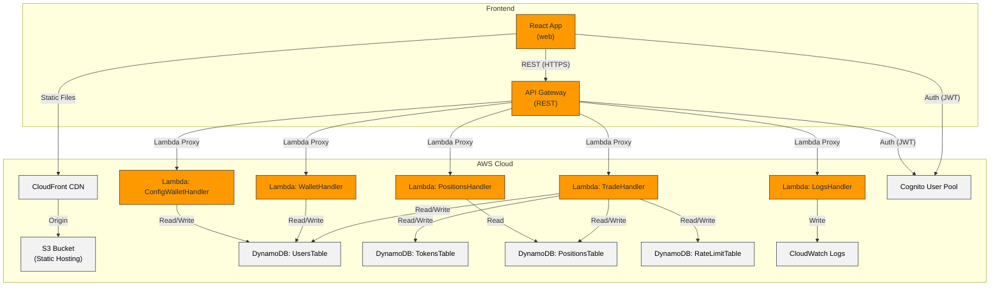
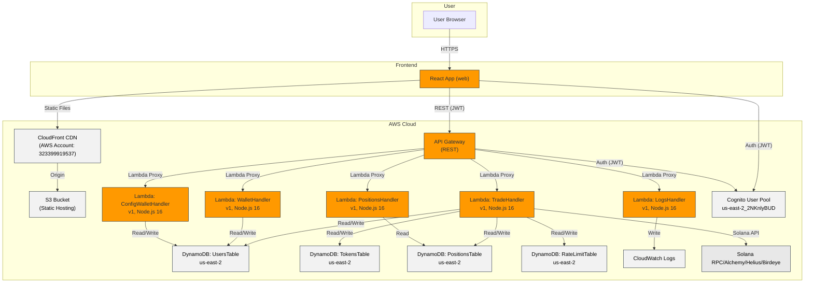

# Sol Sniper

A Solana token sniper bot for automated trading.

## Features

- Real-time token monitoring for newly created tokens
- Automatic liquidity detection
- Token age filtering (focus on tokens within a specific age range)
- Configurable trade parameters (amount, slippage, etc.)
- Automatic take-profit and stop-loss functionality
- Persistent caching to avoid duplicate processing
- Secure user authentication with AWS Cognito
- Serverless architecture using AWS CDK

## Installation

```bash
git clone https://github.com/yourusername/sol-sniper.git
cd sol-sniper
npm install
```

## Configuration

Configure the bot by editing the `.env` file:

```
# Your Solana wallet private key
SOLANA_PRIVATE_KEY=your_private_key_here

# RPC URL - Alchemy recommended for better performance
SOLANA_RPC_URL=https://solana-mainnet.g.alchemy.com/v2/YOUR_ALCHEMY_API_KEY

# Optional API keys for enhanced functionality
HELIUS_API_KEY=your_helius_api_key
BIRDEYE_API_KEY=your_birdeye_api_key
ALCHEMY_API_KEY=your_alchemy_api_key

# Trade parameters
PUMP_SNIPE_AMOUNT=0.02        # SOL amount per trade
STOP_LOSS_PERCENTAGE=50      # 50% stop loss
TAKE_PROFIT_PERCENTAGE=200   # 200% take profit
SLIPPAGE_BPS=1000            # 10% slippage

# Token filtering parameters
MIN_LIQUIDITY_THRESHOLD=5    # Minimum liquidity in SOL
MIN_TOKEN_AGE_HOURS=24       # Only consider tokens at least 24 hours old
MAX_TOKEN_AGE_HOURS=72       # Only consider tokens up to 72 hours old
```

### Setting Up Alchemy (Recommended)

For optimal performance and to avoid rate limiting issues, set up an Alchemy account:

1. Go to [alchemy.com](https://www.alchemy.com/) and create an account
2. Create a new app with the following settings:
   - Chain: Solana
   - Network: Mainnet
   - Name: Solana DEX Trader (or your preferred name)
3. Copy your API key and add it to your `.env` file:
   ```
   SOLANA_RPC_URL=https://solana-mainnet.g.alchemy.com/v2/YOUR_ALCHEMY_API_KEY
   ALCHEMY_API_KEY=YOUR_ALCHEMY_API_KEY
   ```

Using Alchemy provides several benefits:
- Higher rate limits
- Faster response times
- More reliable connections
- Better token age determination

## Deployment

The application is deployed using AWS CDK (Cloud Development Kit). Follow these steps to deploy:

1. Install AWS CDK globally if you haven't already:
```bash
npm install -g aws-cdk
```

2. Configure AWS credentials:
```bash
aws configure
```

3. Build and deploy the infrastructure:
```bash
# Install dependencies
cd infrastructure
npm install

# Build frontend
cd ../web
npm install --legacy-peer-deps
npm run build

# Deploy infrastructure
cd ../infrastructure
npm run deploy
```

4. After deployment, you'll receive the following outputs:
- Website URL (CloudFront distribution)
- API Gateway endpoint
- Cognito User Pool ID and Client ID

5. Update the web application configuration in `web/public/config.js` with the outputs from the deployment.

## Architecture

### Architecture Description
Solana DEX Trader (Sol Sniper) is an automated trading bot and dashboard for the Solana blockchain. It monitors new tokens, evaluates liquidity and token age, and executes trades based on configurable parameters. The system is fully serverless, leveraging AWS for scalability, security, and automation.

**Deployment Model & Infrastructure:**
- **Frontend:** React app built in `/web`, deployed to S3 and served via CloudFront CDN.
- **Backend:** AWS Lambda functions (TypeScript) for trading, wallet management, logging, and configuration, exposed via API Gateway REST endpoints.
- **Authentication:** AWS Cognito User Pool for secure user registration and login, integrated with API Gateway.
- **Data Storage:** DynamoDB tables for users, tokens, positions, and rate limiting.
- **Monitoring:** AWS CloudWatch for logs and metrics.
- **CI/CD:** GitHub Actions workflow automates build, test, and deployment (CDK), including S3 sync and CloudFront cache invalidation.

**Key components include:**
- **React Frontend:** User dashboard, token monitoring, trading controls.
- **API Gateway:** REST interface for all backend operations.
- **Lambda Functions:** Separate functions for trading, positions, wallet, logs, and config, managed in `/lambda` and `/infrastructure`.
- **DynamoDB:** Tables for users, tokens, positions, and rate limiting.
- **Cognito:** User authentication and authorization.
- **CloudFront/S3:** Global static hosting for the frontend.
- **External APIs:** Solana RPC, Alchemy, Helius, Birdeye.

**Deployment and infrastructure notes:**
- Uses AWS CDK v2 for infrastructure-as-code.
- All infra and code are deployed via GitHub Actions (see `.github/workflows/deploy.yml`).
- Environment configuration via `.env` files (see `.env.example`).
- No Docker/Kubernetes; fully serverless.

### Component Overview


### Detailed Architecture


## Disclaimer

This software is for educational purposes only. Trading cryptocurrencies involves significant risk. Use at your own risk.

## License

ISC 